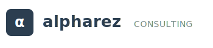
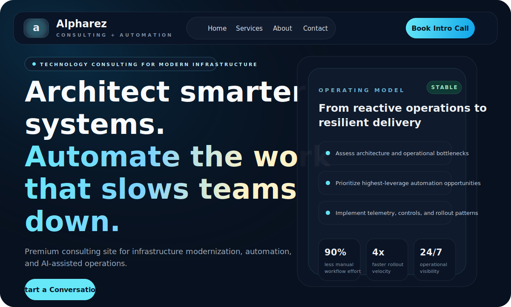

<div align="center">
  

  <h1>Alpharez Marketing Site</h1>
  <p><strong>Consulting + Automation</strong></p>
  <p>Premium marketing site for Alpharez, a technology consulting business focused on infrastructure modernization, automation, and AI-assisted operations.</p>

  <p>
    <a href="https://alpharez.com"></a>
    <a href="#quick-start"></a>
    <a href="#tech-stack"></a>
    <a href="#project-structure"></a>
  </p>
</div>

## Preview
<div align="center">
  
</div>

## Overview
This repository contains the public-facing Alpharez website built with Next.js, React, TypeScript, and Tailwind CSS v4. The site uses a dark, premium visual system and focuses on conversion-oriented pages for `Home`, `Services`, `About`, `Contact`, and `Thanks`.

## Quick Start
```bash
npm install
npm run dev
```

Open `http://localhost:3000` to view the site locally.

## Tech Stack
- `Next.js 15` with the App Router
- `React 19`
- `TypeScript`
- `Tailwind CSS v4`
- `ESLint` with the Next.js config

## Available Scripts
- `npm run dev` starts the local development server with Turbopack.
- `npm run build` creates the production build.
- `npm run start` serves the production build locally.
- `npm run lint` runs linting checks.

## Project Structure
```text
src/app/           App Router pages and global styles
src/components/    Shared layout components
public/            Logos, icons, and marketing assets
```

Key routes:
- `src/app/page.tsx`
- `src/app/services/page.tsx`
- `src/app/about/page.tsx`
- `src/app/contact/page.tsx`
- `src/app/thanks/page.tsx`

## Project Notes
- The site is configured for static export in `next.config.ts`.
- Google Analytics is wired in `src/app/layout.tsx`.
- The contact form posts through Formspree and redirects to `/thanks`.
- Brand assets live in `public/`, including multiple logo variants and supporting imagery.

## Deployment
Build the static site with:

```bash
npm run build
```

The generated export can be deployed to static hosting platforms such as Azure Static Web Apps, Vercel, Netlify, or similar providers.
